# ASPM (Active State Power Management) With GPUs

These will be referecing changing ASPM states on an X870E motherboard, this should be the same across all types and manufactures.

ASPM will try to save power on devices when no traffic is detected on the PCIe link. There are a few states to be aware of and how this can help lower idle power usage. There should be no impact to gaming or similar workloads since the PCIe lanes will have active traffic passing.

### ASPM States

- Auto
    - No ASPM, OS decides what to do
    - Typically the highest idle power
    - Max compatiblity
- L0 Substate
    - Light standby power state when tx side powers down but rx is live
    - Very small latency when exiting L0 Substate
    - Reduced idle power consumption moderately
    - Best for very burst or on/off work loads when you want to reduce idle power consumption
- L1 Substate
    - Deep sleep for the device
    - Tx and rx lines are powered down
    - Clock signal is stopped
    - Max idle power savings, this would be good if you are running iGPU primary and a GPU for AI/Gaming
    - Pretty high latency exiting sleep states
- L0 + L1 Substate
    - L0 for short term power savings
    - L1 for long idle saving
    - Again, use this if you are running iGPU primary display out and having a dedicated GPU for AI/Gaming but passing all video out the iGPU port

Realistically L0+L1s will yield max savings and for most all users the power on latency will not be noticed.

```mermaid
graph TD
    A[ASPM Settings] --> B{Options}

    B --> C[Disabled]
    B --> D[L0s]
    B --> E[L1]
    B --> F[L0s + L1]

    C --> C1[L0: Full Power]
    C1 --> C2[Idle: 20-50W]
    C1 --> C3[Load: No Impact]

    D --> D1[L0s: Tx Off]
    D1 --> D2[Idle: 5-15W less]
    D1 --> D3[Load: No Impact]

    E --> E1[L1: Tx+Rx Off]
    E1 --> E2[Idle: 10-30W less]
    E1 --> E3[Load: No Impact]

    F --> F1[L0s or L1]
    F1 --> F2[Idle: 4-13W]
    F1 --> F3[Load: No Impact]

    classDef power fill:#0b0b0b,stroke:#333;
    classDef result fill:#0d0d0d,stroke:#333;
    class C1,D1,E1,F1 power;
    class C2,C3,D2,D3,E2,E3,F2,F3 result;
```

