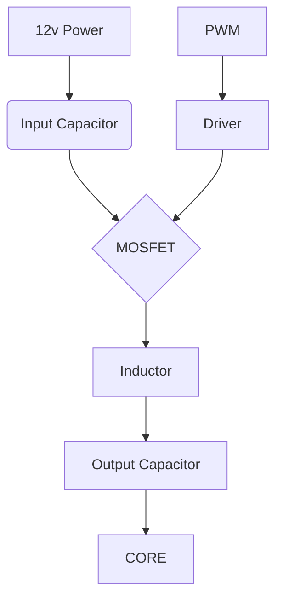
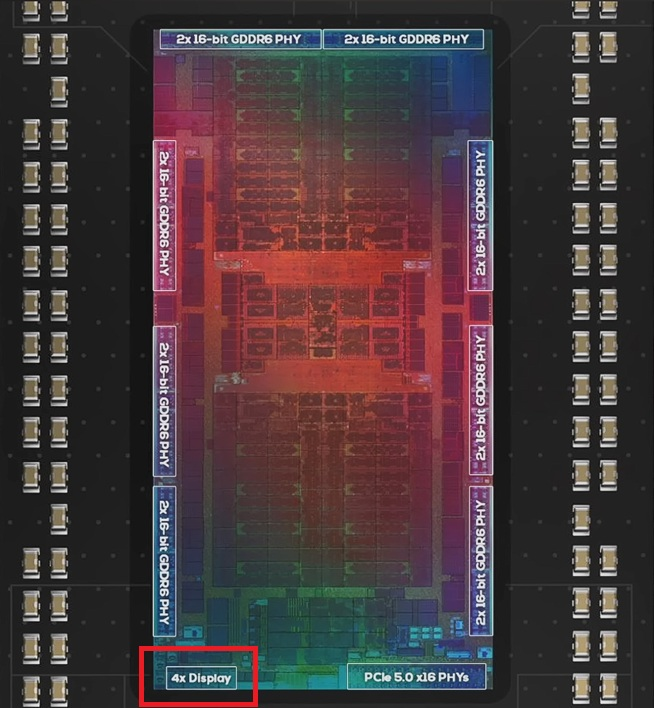

# Trying To Understand GPU Components

I dont really have much of a goal here, just want to understand a bit deeper on the components of a GPU. Specifically the VRM side since that seems to be where most of the failures occur. I do repair GPUs every now and then, mostly just simple component replacement etc... Buying and running older gpus on modern systems, its always fun to see how an 8 year old GPU handles games and software when completely running at its limit on a modern CPU/MB/RAM/NVME. Stacking an RX 590 with a 9950X3D in DCS World is quite the experience. 

### Common Components

- Common Surface Mount Components
    - Capacitors
        - Resists change in voltage, used for noise filtering and bulk storage in VRM phases. MLCCs (Multi-Layer Ceramic Capacitor) for high frequency and polymer for low frequency
    - Inductors/Chokes
        - Magnetic field energy storage in buck converters
        - Chokes are specialized inductors that filter out AC or block high frequency signals
    - MOSFETs
        - Switching for VRM phases, high/low-side paired with drivers
    - Diodes
        - Rectification, reverse protection and ESD protection
        - Less prevalent on modern GPUs with synchronous buck converters
    - Resistors
        - Voltage sensing, current limiting, precision for feedback
    - Integrated Circuits(ICs) and Micro controllers
        - PWM controllers
        - Drivers
        - PMICs for VTM Sequencing
        - EEPROM
    - Fuses
    - Crystals/Oscillators
        - Clock Generator for controllers/sensors
    - LEDs
    - Headers
        - Fans and sensor physical links

### Capacitors - MLCC (Multi-Layer Ceramic Capacitor)

### Capacitors - Polymer

### Inductor

Note the ridges on top of the inductor, this is probably one that is open air cooled and does not contact a cold plate or heatsink.

### MOSFETs - High and Low

### MOSFETs - High Side

High side MOSFETs will be position or connected closer to the input voltage/traces.

### MOSFETs - Low Side

Low side MOSFETs will be position or connected closer to the ground plane (the large plane that connects many things)

### Driver

### Integrated VRM MOSFETs And Driver

### Resistors

### EEPROM

### PWM

### Other Components

There are a number of other IC's and voltage control circuits. 

### Understanding The VRM

**Purpose:** Convert 12v power and deliver it down to usable power for GPU components like the core and vram at much lower voltage levels. This power can come from the PCIe power connectors as well as the PCIe slot.

The VRM not only down-converts power to be safe and useable but it also keep the voltage incredibly stable.

2 main designs of VRMs, discreet and integrated.

- Discreet VRM
    - Separate components for the driver, IC, high-side MOSFET, low-side MOSFET
    - Takes up more space but very customizable by component
    - More common in cheaper and older GPUs
- Integrated VRM
    - DrMOS or Smart Power Stages
    - Combines the driver, high/low-side MOSFETs into a single package
    - Much smaller VRM to package, typically includes built in monitoring
    - Typically contains DrMOS (Driver-MOSFET) which can be packed with much higher density on PCBs

### Simplified Diagram

Types of VRMs applied to a GPU.

- Vcore (GPU Core VRM)
    - Bulk of power phases on the GPU
    - Multi-phase with current sharing for stability at max power and clock rates
- VDD/VDDQ (Memory VRM)
    - Powers the VRAM
    - Usually 1 to 3 phases separated for isolation
- PCIe and I/O VRM
    - Usually smaller and no dedicated multi phases
    - Used for PCIe lanes, NVENC chips, display controllers
    - Can be integrated into the SOC rail
- Comm VRM-Related Components
    - VDDCI (Memory Interface)
        - Memory bus voltage regulation
        - Typically derived from memory VRM or a smaller separate phase
    - PLL and Aux Rails
        - Low current for clock generators, sensors

### Discreet VRM Details

Most commonly will have 2 MOSFETs for the high and low sides coupled with a driver. With these components stacked together they being a highly optimized **buck-converter**. Buck essentially are DC to DC converters, taking in high voltage and stepping down to a lower voltage. **High-side** MOSTFETs will connect to the 12v side of the GPU power delivery, and **Low-side** will connect to ground. There are other connections but this is the most import to quickly ID High vs Low side.

To manually check with a multi-meter connect one end to the IO Shield/Ground and probe the the suspect MOSFETs source. If you have continuity between its source and ground its most likely the Low-side MOSFET. If you connect to the 12v input and probe the drain of the suspect MOSFET, if it has continuity it is the High-side MOSFET.

### MOSFET Source, Drain, and Gate

- Source
    - Input Charge/Voltage
- Drain
    - Connect to the Load, the thing the MOSFET is controlling
    - Load
        - Typically GPU Die, Memory etc...
- Gate
    - When voltage is applied this allows voltage to reach the Load via the Drain
    - Controls the light switch, use low power to control high power

### How Does The Low/High Side Work Together

### What Role Does The Driver Play

The driver precises switches on and off high/low sides which are essentially square waves. But the timing and duty-cycle(high side) are controlled by the driver dynamically. The driver will let voltage in on the high side creating a rise in voltage, then it is switched off. After a small amount of time passes the driver will turn on the low side grounding out the voltage. The outcome of this is stepped down voltage that can be dynamically controlled. Take in 12v, and under X number of conditions adjust the output voltage to desired levels. 

**THIS IS ESSENTIALLY A BUCK CONVERTER**

Timing for this is controlled by an external clock source. 

### Integrated VRM

These work essentially the same as the discreet separated sides and driver. This is just packaged into a single device.

### The Role Of Resistors

Resistors control current flow, divide voltage and provide reference points in circuits. Sometimes they are used to bridge circuits together (0 ohm resistor).

- Monitoring
    - Resistors can divide voltage down to provide a way to read a circuit at a safer voltage level.
    - If you need to read a 1.2v circuit but the sensing line can only take a fraction of that voltage you can use a resistor to divide that voltage down to usable levels.
        - This is via voltage divider networks where resistors are connected in series between the voltage and ground.
            - The junction point at which the resistors meet is the sensing voltage used for measurement. 
        - This is very useful for measuring the various rails on a GPU which provide input voltages.
        - The sensing voltage from the junction is piped to an analog to digital converter which can be read by the onboard monitoring chip.
- Current Limiting
    - To obtain a desired maximum amperage a resistor can be placed in series with a device to limit how much power can be delivered to that device.
        - Helps reduce burned out components.
    - Can be placed in power paths to reduce high current inrush.

### Voltage Rail / VRM Diagram

```mermaid
graph TD
    subgraph "Input Power Sources"
        PCIeSlot["PCIe Slot<br>(75W: 12V up to 66W, 3.3V up to 9.9W)"] --> InputFilter["Input Filtering Capacitors<br>(Electrolytic & MLCC for Ripple Suppression)"]
        ExtConn1["External 8-pin Connector 1<br>(150W: 12V, Multiple Ground Pins)"] --> InputFilter
        ExtConn2["External 8-pin Connector 2<br>(150W: 12V, Multiple Ground Pins)"] --> InputFilter
    end

    InputFilter -->|Filtered 12V Rail| GPU_PWM["GPU PWM Controller<br>(Infineon XDPE132G5D)<br>Multi-Phase Digital Controller<br>Manages 14-18 Phases, Telemetry, OCP/OVP"] 

    subgraph "GPU Core VRM (14-18 Phases)"
        GPU_PWM -->|PWM Signals| GPU_Driver1["Phase 1 Driver IC<br>(Integrated in DrMOS)"]
        GPU_PWM -->|PWM Signals| GPU_Driver2["Phase 2 Driver IC<br>(Integrated in DrMOS)"]
        GPU_PWM -.->|...| GPU_DriverN["Phase N Driver IC<br>(Integrated in DrMOS)"]
        
        GPU_Driver1 -->|Gate Drive| GPU_HS1["High-Side MOSFET<br>(IR TDA21490 DrMOS Integrated, 90A Rated)<br>Switches 12V Input"]
        GPU_Driver1 -->|Gate Drive| GPU_LS1["Low-Side MOSFET<br>(IR TDA21490 DrMOS Integrated, 90A Rated)<br>Synchronous Rectification"]
        
        GPU_Driver2 -->|Gate Drive| GPU_HS2["High-Side MOSFET<br>(IR TDA21490 DrMOS Integrated)"]
        GPU_Driver2 -->|Gate Drive| GPU_LS2["Low-Side MOSFET<br>(IR TDA21490 DrMOS Integrated)"]
        
        GPU_DriverN -->|Gate Drive| GPU_HSN["High-Side MOSFET<br>(IR TDA21490 DrMOS Integrated)"]
        GPU_DriverN -->|Gate Drive| GPU_LSN["Low-Side MOSFET<br>(IR TDA21490 DrMOS Integrated)"]
        
        GPU_HS1 & GPU_LS1 -->|Switch Node| GPU_Inductor1["Inductor/Choke<br>(Ferrite Core, ~220nH)<br>Energy Storage & Smoothing"]
        GPU_HS2 & GPU_LS2 -->|Switch Node| GPU_Inductor2["Inductor/Choke"]
        GPU_HSN & GPU_LSN -->|Switch Node| GPU_InductorN["Inductor/Choke"]
        
        GPU_Inductor1 & GPU_Inductor2 & GPU_InductorN -->|Combined Output| GPU_OutputCaps["Output Capacitors<br>(Polymer Tantalum SP-Caps & MLCC Arrays)<br>Voltage Smoothing, Decoupling"]
        
        GPU_CurrentSense["Current Sense Resistors<br>(Shunt Resistors for Phase Current Monitoring)"] -.->|Feedback| GPU_PWM
        GPU_VoltageSense["Voltage Sense Resistors/Dividers<br>(Feedback Network for Regulation)"] -.->|Feedback| GPU_PWM
    end

    GPU_OutputCaps --> GPU_Core["GPU Core (Navi 21 XTXH)<br>Vcore ~0.8-1.3V Dynamic, Up to 300A+"]

    InputFilter -->|Filtered 12V Rail| Mem_PWM["Memory VRM PWM Controller<br>(IRF35217 or Similar)<br>3-Phase Digital/Analog Controller<br>With OCP/OVP"]

    subgraph "VRAM Power Delivery (3 Phases)"
        Mem_PWM -->|PWM Signals| Mem_Driver1["Phase 1 Driver IC<br>(Integrated in DrMOS)"]
        Mem_PWM -->|PWM Signals| Mem_Driver2["Phase 2 Driver IC<br>(Integrated in DrMOS)"]
        Mem_PWM -->|PWM Signals| Mem_Driver3["Phase 3 Driver IC<br>(Integrated in DrMOS)"]
        
        Mem_Driver1 -->|Gate Drive| Mem_HS1["High-Side MOSFET<br>(IR TDA21472 DrMOS Integrated, 72-90A Rated)"]
        Mem_Driver1 -->|Gate Drive| Mem_LS1["Low-Side MOSFET<br>(IR TDA21472 DrMOS Integrated)"]
        
        Mem_Driver2 -->|Gate Drive| Mem_HS2["High-Side MOSFET<br>(IR TDA21472 DrMOS Integrated)"]
        Mem_Driver2 -->|Gate Drive| Mem_LS2["Low-Side MOSFET<br>(IR TDA21472 DrMOS Integrated)"]
        
        Mem_Driver3 -->|Gate Drive| Mem_HS3["High-Side MOSFET<br>(IR TDA21472 DrMOS Integrated)"]
        Mem_Driver3 -->|Gate Drive| Mem_LS3["Low-Side MOSFET<br>(IR TDA21472 DrMOS Integrated)"]
        
        Mem_HS1 & Mem_LS1 -->|Switch Node| Mem_Inductor1["Inductor/Choke<br>(Ferrite Core)"]
        Mem_HS2 & Mem_LS2 -->|Switch Node| Mem_Inductor2["Inductor/Choke"]
        Mem_HS3 & Mem_LS3 -->|Switch Node| Mem_Inductor3["Inductor/Choke"]
        
        Mem_Inductor1 & Mem_Inductor2 & Mem_Inductor3 -->|Combined Output| Mem_OutputCaps["Output Capacitors<br>(Polymer & MLCC)"]
        
        Mem_CurrentSense["Current Sense Resistors"] -.->|Feedback| Mem_PWM
        Mem_VoltageSense["Voltage Sense Resistors/Dividers"] -.->|Feedback| Mem_PWM
    end

    Mem_OutputCaps --> VRAM_Chips["GDDR6 VRAM Chips<br>(Samsung K4ZAF325BM-HC18 or Similar)<br>Vmem ~1.35V, Up to 50A+"]

    InputFilter -->|Filtered 12V/3.3V Rail| Aux_VRM["Auxiliary VRMs<br>(SOC, PLL, Misc Rails)<br>1-2 Phases Each, Smaller Controllers (e.g., RT8816)<br>With Dedicated MOSFETs/Inductors/Caps"]

    Aux_VRM --> Aux_Components["SOC, PLL, I/O, Fans, LEDs<br>(Various Low-Power Rails ~1-5V, 5-20A)"]

    style PCIeSlot fill:#000,stroke:#333
    style ExtConn1 fill:#000,stroke:#333
    style ExtConn2 fill:#000,stroke:#333
    style GPU_Core fill:#354355,stroke:#333
    style VRAM_Chips fill:#124355,stroke:#333
    style Aux_Components fill:#444,stroke:#333
```

### VRAM

VRAM is pretty cheap nowadays (2025) but there is a lot of design consideration that goes into the entire GPU package. Right now even through retail means to buy GDDR6 its less than $1 per Gbit. It is not as straight forward as just make a GPU for cheap that has 48GB onboard, there are serious design elements that must go into how to run and sync 1000's of mechanical traces 3-dimensionally through the PCB and then to the die. 

Just going to look at typical VRAM setups with BGA (Ball Grid Arrays). 

JEDEC (Join Electron Device Engineering Council) developes and maintains various standards in the electronics industry. JEDEC essentially creates the standards for things like GDDR5/6/7 but manufactures and silicon designers will often stray from standards. GDDR6X is not an official standard and is considered proprietary. 

GDDR (Graphics Double Data Rate) memory does follow a mostly similar pinout:

- Data Pins (DQ)
    - Bi-directional data lines
    - R/W operations
- Address Pins (A)
    - Row/Column addressing
    - Select memory locations
- Command Pins
    - CAS# (Column Address Strobe)
    - RAS# (Row Address Strobe)
    - WE# (Write Enable)
        - Activate, Read, Write
- Clock Pins (CK, CK#)
    - Differential clocks for synchronization
- Power/Ground Pins
    - VDD (Core Voltage)
    - VDDQ (I/O Voltage)
    - VSS (Ground)
    - VPP (Pump Voltage)
        - Newer feature
    - VREF (Reference Voltage)
        - Used for comparison
- Other Pins
    - RESET#
    - EDC (Error Correction)
    - DBI (Data Bus Inversion)
    - Mode specific pins

Pinouts can change significantly by generation as well.

- GDDR5: 170 ball BGA
- GDDR5X: 190 ball BGA
- GDDR6: 180 ball BGA
- GDDR6X: 180 ball BGA but proprietary
- GDDR7: 266 ball BGA

### Micron GDDR6 Example

### GDDR6 BGA Pinout

This view is top down as if you are looking through the vram chip, this is not looking at the backside. Not like we are going to tshoot this but just an FYI for orientation.

### VRAM Connects To GPU Die Memory Controller

Several types of pins connect directly to the GPU die memory controller inputs, there is no intermediary device. What is important to know is the VRAM traces are all the same length to the die. A difference of even 1mm will lead to large delays/latency. Connections are point to point to reduce any signal impedance/crosstalk etc... 

Here is an image from <a href="https://www.youtube.com/watch?v=u8cfrJTdo0E">High Yield on Youtube showing the RNDA4 PHY's</a> which interconnect the GDDR6 VRAM to the RDNA4 die.

And an image of the RDNA4 memory controllers.

# IO Connectivity To Die

How do HDMI and Display Ports connect to the GPU?

Connectivity between IO and the die is pretty straight forward, however, great care is take to route traces since any interference/crosstalk etc... could render the GPU as useless. If a GPU (outside of the DC) cannot output video its not very useful for work or gaming.

### Simplified Diagram

**NOTE** A PHY is a physican interconnect on the BGA of the GPU's die. Just think of a PHY as the usb port which connects things physically to the die.

- PHY = Physical Layer = Physical Interface

RDNA4 Display PHY, and you can also see the pcie and vram phys.

```mermaid
graph LR
    subgraph "GPU Die (RDNA2 Navi 21)"
        DisplayEngine["Display Engine<br>(Handles Video Output)"] --> HDMI_PHY["HDMI PHY<br>(TMDS Encoding)"]
        DisplayEngine --> DP_PHY1["DP PHY 1<br>(Main Link Encoding)"]
        DisplayEngine --> DP_PHY2["DP PHY 2<br>(Main Link Encoding)"]
        DisplayEngine --> DP_PHY3["DP PHY 3<br>(Main Link Encoding)"]
    end

    HDMI_PHY --> PCB_Traces["PCB Traces<br>(Differential Pairs)"] --> HDMI_Port["HDMI Port"]
    DP_PHY1 --> PCB_Traces --> DP_Port1["DP Port 1"]
    DP_PHY2 --> PCB_Traces --> DP_Port2["DP Port 2"]
    DP_PHY3 --> PCB_Traces --> DP_Port3["DP Port 3"]

    Aux_Power["Aux Power<br>(5V/3.3V)"] --> HDMI_Port & DP_Port1 & DP_Port2 & DP_Port3
    I2C_Bus["I²C Bus<br>(EDID/Control)"] --> HDMI_Port & DP_Port1 & DP_Port2 & DP_Port3

    style DisplayEngine fill:#0b0b0b0,stroke:#333
    style HDMI_PHY fill:#ff1111,stroke:#333
    style DP_PHY1 fill:#0f3455,stroke:#333
    style DP_PHY2 fill:#0f3455,stroke:#333
    style DP_PHY3 fill:#0f3455,stroke:#333
    style HDMI_Port fill:#ff4444,stroke:#333
    style DP_Port1 fill:#000132,stroke:#333
    style DP_Port2 fill:#000132,stroke:#333
    style DP_Port3 fill:#000132,stroke:#333
```

# Locating GPU Faults/Issues

## Visual Inspection Before Taking GPU Apart

Not 6 hours ago I recieved a "refurbished" RX 5700 XT from Newegg that was bent, and missing screws. A few days ago I received the same model of RX 5700 XT from an ebay seller that was severely bent. 

If you are buying used like I do the GPUs need a pretty healthy visual inspection. I find that very old GPUs (GTX 700 or HD 7000 and before) typically have much less wear and tear than GTX 900, RTX 2000/3000, all RNDA and Polaris on the used market. A lot of these GPU were bought by miners with dreams of getting rich. 

I tend to stay away from Vega GPUs, anything HBM that isnt a Titan V or R9 as most Vega VII and 56/64s are pretty brutalized. Polaris also received a lot of miner abuse but they are very low wattage and simple, I have never had a problem with them. Turing and Ampere GPUs can be pretty mixed, just depends on if heat was addressed but Ampere does offer LHR gpus that were not well utilized for mining. 

Without taking the gpu apart, look through it.

- Hold the GPU in different positions and spin the fans to validate bears are not grinding
- Look into the DP/HDMI ports, do you see any bent communication pins
- Look at the PCIE x16 connector, are any pads bridged together
    - Look at the traces (the little wires covered up by the black/blue/green mask) are they broken or cut/cracked
- Look for large amounts of sticker or tape residue
- Don't be deterred if the GPU is dusty (white or grey or very light brown dust) and full of cat hair
    - This means the GPU was on and running for some time
- Don't be deterred if you can see a light silicon oil around old thermal pads, you will need to replace these but its not an emergency, old pads still work
- Be highly suspect of an extremely clean GPU unless it comes from a refurbisher
    - I have seen GPUs for sale that were clearly just fully dipped in an ultrasonic cleaner, this isnt bad for the GPU but can be horrible for fan bearings
- If there is any dark brown or black dust be highly suspect as this probably spent its down in a garage or unfiltered outdoor spaces (mining)
- If there is sticky dark residue it was probably ran in an industrial or garage based mining operation
- Check for the visible pads on the VRM/VRAM etc... do they make solid contact with the cooler?
- Check for the QC/Warranty stickers that are typically on one or two of the screws that hold the cooler to the die, usually on the backplate. Are they penetrated, torn, missing?

## Visual Inspection Of Disassembled GPU

### Bubbles

Bubbles due to someone using a hot air gun with to much time on target or intensity.

### Missing Components

Missing or mis-aligned components most likely caused by a poor repair

### Did They Put It In The Oven

Loose stickers are fine, its possible the board was cleaned with lots of alcohol simply dissolving the glue but curled up stickers are generally from heat. This could be from someone trying an oven repair or the card severely overheating.

### Screw Heads

Screw heads that have been stripped out is super common. Not using the correct driver, or trying to use a JIS or PZ for a PH. Using a PH0 when you needed a PH00 etc... This tells you whomever was working on the gpu did not know or was in a rush. Back when I was thermal testing on RX 5700 XT's, specifically a Red Devil model, then an ASUS Strix I disassembled and reassembled each card hundreds of times. Never stripped a screw. This was not because I'm the best at turning the driver, its just from using the correct size driver.

### Small Blown SMDs

A single blown capacitor may not inhibit the GPU to function so a good visual inspection specifically looking for this type of failure is needed. 

Blown MOSFET

Blown coil/inductor

### Broken/Chipped/Failed PCIe Connector

### Bridged PCIe Pins

This is an image I took from an ebay "refurbished" gpu I received.

Its hard to tell but this was bridging pins 4 (Ground) and 5 (SPI2_SCK serial clock line) which at best would have caused the GPU to just not work, at worst possibly damaged components or the motherboard.

