# Core Ultra Tunings

I originally started this just as a repo to keep a general overview on what primary/secondary/voltage tuning for my current CUDIMMs but I ended up adding some more notes. This eventually just turned into a loose Core Ultra tuning dump. I don't tune RAM often so I tend to forget between builds, this should just serve as simple guidelines on RAM tuning, everything else should probably get cut out.

**NOTE** There is a known issue with running iGPU on RAM faster than 7200MT/s. I was running into iGPU artifacting, after testing and dropping down the official supported speed it went away. That led to some research and I found a large number of these complaints, once DDR5 > 7200MT/s 3600Mhz it can cause the current linux drivers to become unstable. This issue did not persist beyond ubuntu, it was not present in windows even at 8600MT/s. 

This is just notes for myself as I flip flop between brands quite often and everything starts to homogenize. This is not a tuning guide, just notes.

In the end 125w semi-tuned is the way to go. I will probably just run 75w and remove my gigantic bequiet Dark Rock Elite cooler and toss on the Intel Laminar RH1 because it looks silly. 

### Primer

Just some items specific to Core Ultra.

- P-Core (Performance high wattage cores)
- E-Core (Efficient low wattage cores)
- Ring Bus (aka Cache Ratio)
    - Interconnects the cores and cache inside the compute tile
    - Minimal performance gain overall but will increase quite a bit for latency sensitive applications that hit cache rapidly
- NGU (Next Generation Uncore)
    - Uncore is anything that is not the main core/processor. This is the speed that everything but the CPU will communicate between each other
    - Pretty large overall gains in all games/applications
    - Increasing frequency greatly reduces latency
- D2D (Die to Die)
    - Compute to SoC tile interconnect frequency
    - Large performnace gains in workloads that are cross tile
    - Heavily reduced tile to tile latency
    - Increasing D2D will yield immediate increases to benchmarks
- iGPU Ratio
    - Controls the clocking of the iGPU
- Vcore
    - Primary voltage for P/E Cores
- VCCSA (System Agent Voltage)
    - Powers memory controller and NGU
    - Can be set slightly higher to achieve high memory and NGU speeds
- Ring DLVR
    - Voltage for the ring bus / cache ratio
- VNNAON
    - Base voltage for D2D
- VCCIA
    - VRM Core Input Voltage
    - Input to DLVR
- Memory Frequency
    - Core Ultra is very sensitive to memory bandwidth and latency
    - Stacking with CU-DIMMs at high speed is great but tuning primary and secondary timings will sharply increase memory bandwidth and reduce latency
    - When combined with tuned NGU/D2D/Ring Bus you can increase performance 15-20% without a large amount of work.

### RAM Tuning

You can tune Intel CPUs very quickly, most of the time just set your power, setup your ratios and undervolt, then done. However if you start tuning ram, you will want a pretty methodical way to test, check, document, adjust and back test. RAM tuning can yield significant bandwidth and reduced latency which will impact core ultra processors. Here is some base data that I typically have to go back and reference when tuning ram. Some people will tune ram for a horrifying amount of time, I will typically spend an hour or two on it with tests using passmark memory mark/cinebench. Stability testing after you feel things are tuned can be done with OCCT or AIDA64.4

Get a baseline, retest under the same exact scenarios every time. Document each test/step and only change 1 thing at a time. Start with your XMP2 profile and go from there. 

- Set XMP
    - In our Z890 ASUS MB we will use XMP2 profile
- Set your max frequency
    - I am running 8200MT/s CUDIMMs so I will attempt to get up to 8400 - 8600, setting your maximum stable frequency is the bedrock which all other tunings rely on
    - Gear 2
        - Memory controller runs at 50% DRAM frequency
    - Gear 4
        - Memory controller runs at 25% DRAM frequency
    - I have never ran into the need to use Gear 4, I don't get that deep into DRAM timing and tuning. Everything I run is Gear 2
    - Bump up to 8400MT/s from 8200MT/a, test
    - If this is stable try 8600MT/s, most likely you will be able to reach 8600MT/s with this kit, anything beyond introduces failure on boot
- Set your RAM voltage
    - Our RAM: F5-8200C4052G24GX2-TZ5CK
    - Using XMP2 we have now set a voltage known to be compatible with (in our case) 8200MT/s or 4100mhz DRAM speed
    - In most cases we dont need to push this anymore as it will already be set to 1.4v with XMP
- Set Primary Timings (In this order)
    - CAS Latency (tCL)
        - Common Names: CAS Latency, tCL, CL
        - Effect: Reduces overall latency and improves application/game response time
        - Adjust: Lower by 2 at a time, this is heavily impacted by RAM voltage
    - RAS to CAS Delay (tRCD)
        - Common Names: RAS to CAS Delay, tRCD, tRCDRD/tRCDWR
        - Effect: Boosts bandwidth by speeding up row to column transitions, heavily impacts professional workloads like video editing
        - Adjust: Lower by 2 or 4 at a time, increase VCCSA/VSOC for stability
    - Row Precharge Time (tRP)
        - Common Names: Row Precharge Time, tRP
        - Effect: Improves row switching speed, increases random access speed and reduces latency
        - Adjust: Should match or exceed tRCD
    - RAS Active Time (tRAS)
        - Common Names: Row Active Time, tRAS, Active to Precharge Delay
        - Effect: Ensures row stability during access, optimizes sustained workloads with stability over speed
        - tRAS is created from a calculation
            - tRCD + tRP + margin of 6 to 8
                - Example: 40 (tRCD) + 40 (tRP) + 8 = 88 so we will use this number here. This number should be updated as you go.
- Set Secondary Timings (To be finished)
    - Write Recovery Time (tWR)
        - Try to keep tWR the same as tRAS or close to it
        - Lower is faster
    - Refresh Interval (tREFI)
        - Raising tREFI will put heat into the RAM
        - Try to not exceed 50c, you will need to increase this and retest
        - Set in ((n * 8192) - 1)
        - Interval between refresh commands, higher value is less refresh interruptions, higher is better
        - You risk dataloss if set to high
    - Refresh Cycle Time (tRFC)
        - ns * MCLK (Ghz)
        - ns = To pull this number you will need to look at what specific RAM chips are in your DDR5 kit. Different manufacturers will have a different minimum tRFC ns starting point for each chip usually by size
            - 80ns * 4.1 = 328, round up to the next 32
                - 352
                - Increase by 32 at a time and test
                - Increase should bring RAM heat down
                - To tight a value will bring heat/errors
        - For my RAM kit with F5-8200X4052G24G from SK Hynix
            - 160ns base tRFC_ns, I will pad to 164
            - Currently running at 8600MT/s
            - Calc
                - 2000 / 8600 = 0.2325
                - 164 / .2325 = 705.3783, round up 706
    - Read to Precharge (tRTP)
        - Skipping
    - Row to Row Delay (tRRD)
        - Skipping
    - Four Activate Window (tFAW)
        - Skipping
    - Write to Read Delay (tWTR)
        - Skipping
    - CAS Write Latency (tCWL)
        - Skipping
    - Row Cycle Time (tRC)
        - Skipping
    - Command Rate (CR)
        - Skipping

### Flowchart

```mermaid
flowchart TD
    A[Start: Enter BIOS] --> B[Enable XMP2 Profile for 8200 MT/s]
    B --> C[Set Gear Mode to Gear 2]
    C --> D[Set Max Frequency: Try 8400 MT/s]
    D --> E[Test Stability e.g., MemTest86/AIDA64]
    E -->|Stable| F[Try 8600 MT/s]
    E -->|Unstable| G[Revert to Previous Freq, Adjust VDIMM +0.05V if Needed]
    F --> E
    G --> H[Set RAM Voltage: Confirm 1.4V from XMP, Tweak if Unstable]
    H --> I[Set Primary Timings in Order]
    I --> J[tCL: Lower by 2, Test, Increase VDIMM if Needed]
    J --> K[tRCD: Lower by 2-4, Test, Increase VCCSA for Stability]
    K --> L[tRP: Lower by 1-2, Match/Exceed tRCD, Test]
    L --> M[tRAS: Calc tRCD + tRP + 6-8, Update as Tuned, Test]
    M --> N[Set Secondary Timings]
    N --> O[tWR: Set ~tRAS or Lower, Test]
    O --> P[tREFI: Set High e.g., n x 8192 -1, Monitor <50°C, Retest if Heat/Errors]
    P --> Q[tRFC: Calc ns * MCLK GHz e.g., 195-300ns Base, Round Up to Next 32, Increase by 32 if Heat/Errors]
    Q --> R[Final Stability Test: Run 4-8 Hours, Monitor Temps/Power]
    R -->|Stable| S[Done: Enjoy Optimized RAM]
    R -->|Unstable| T[Loosen Timings or Increase Voltages, Retest]
    T --> R
```

### Useless Background Stuff

There are many ways to tune Intel cpus, previous generations definitely responded to tuning in a more direct or linear way. With the tile on interposer setup of the Core Ultra along with the specifics that enhance overall performance a slightly differnet approach needs to be taken. If you want cheaper and easier gaming performance I strongly suggest any AMD cpu from the 9000 series. I will often switch back to intel if I run workloads that require a better iGPU (video editing) or if I feel the need to run very low idle power usage. 

Personally, I find the Core Ultra's easier to extract a middling amount of performance but harder at the peak levels. Extracting that last few percent is all about memory tuning and adding lots of power. Older generations like my delidded 14900K you can pretty easily drive performance into the stratosphere with just a couple changes and undervolting. 

Nowadays I don't overclock much, I typically power limit down quite a bit, undervolt, and just enjoy cool and calm temps. I don't game as much as I used to so extreme peak performance isnt needed. However, I still want to tune things to extract the easy 10-15% performance. 

I also like to swap out coolers and run power limits just to see what life if like at 65 watts.

Overall for Core Ultra the game is to reduce latency and increase tile to tile communication.

### Setup at the time of this writing

- Core Ultra 265K
- ASUS Proart Z890
- G.Skill Trident Z5 CK CU-DIMM 8200MT/s 24GB x 2
- bequiet! Dark Rock Elite (285w TDP)

### Settings - Easy Low Power Mode 125w

125w on a tuned Core Ultra 265K will net you around 25-27000 in Cinebench R23.

To put this in perspective of multi-core performance:

- Ryzen 7 9700X 21500 points
- Core Ultra 245K 25000 points
- M1 Ultra 24000 points

- Performance Limits: Intel Default
- XMP Profile: XMP2 (Dimms XMP Profile, no ASUS Tuning)
    - Tune the ram after CPU is stable
- PL1: 125w
- PL2: 125w
- Max Temp: 85c
- P-Core Voltage Offset: -0.070v (70mv)
- E-Core Voltage Offset: -0.055v (55mv)
- I dont use 200S Boost as this will limit RAM speed and other items, use the following
    - RING/LLC Clock: 3800 (38x)
    - D2D (Die to Die) Clock: 3300 (33x)
    - NGU Clock: 3200 (33x)
    - iGPU Ratio: 24x
- RAM specific tuning
    - TBD I need to go back through and get a multi-day stable tune worked out~~

### Settings - Easy High Power Mode 200w

- Performance Limits: Intel Default
- XMP Profile: XMP2 (Dimms XMP Profile, no ASUS Tuning)
    - Tune the ram after CPU is stable
- PL1: 195w
- PL2: 195w
- Max Temp: 85c
- P-Core Voltage Offset: -0.070v (70mv)
- E-Core Voltage Offset: -0.055v (55mv)
- I dont use 200S Boost as this will limit RAM speed and other items, use the following
    - RING/LLC Clock: 3800 (38x)
    - D2D (Die to Die) Clock: 3200 (32x)
    - NGU Clock: 3200 (32x)
    - iGPU Ratio: 25x
- RAM specific tuning
    - TBD I need to go back through and get a multi-day stable tune worked out

### Test And Validate

The most import part of tuning regardless if you are going to max efficiency , performance or in my case a mix is to document, test, and validate.

- Document each change serially
- Test the system for stability in the same manner each time
- Document the stability test for that change
- Only after your documentation is updated and testing completed move onto the next step
- This is crucial especially for even mild manual tuning of RAM

### Test And Tune

| Category | What Changed | C23 Multi | CPU Mark / Single | AIDA64 Read BW | AIDA64 Latency | Notes |
| ---- | ---- | ---- | ---- | ---- | ---- | ---- |
| Base | XMPII 8200, PL1/2 200w No UV | 35513,34457,35438 | 60599, 5113 | 110.64GB/s | 84.5ns |  |
| Tile Ratios | Ratios iGPU 24x, Ring/Cache 38x, NGU 33x, D2D 33x | 33186,33882,34589 | 60179, 5128 | 113.53GB/s | 78.2ns | Looks like we lose some multi-core but have better BW/latency |
| Undervolt | P-Core -0.080v, E-Core -0.055v, iGPU -0.020v | 34081,35689,34887 | 60322, 5131 | 113.94GB/s | 80ns | Looks like we are just power limited at this point |
| RAM Tuning | Bumped to 8400MT/s | 34639,35676,34154 | 60819, 5130 | 116.21GB/s | 77.5ns | RAM is improving |
| RAM Tuning | Bumped to 8600MT/s | 34049,35405,35157 | 60642, 5130 | 117.45GB/s | 76.4ns | RAM is better, this won't really show in the CineR23 and Passmark |
|  |  |  |  |  |  | Saved to Profile 1 "base" |
| RAM Tuning | tCL CAS 40 -> 38 | 34065,35671,34952 | 60702, 5127 | 117.12GB/s | 77.1ns | No measurable difference |
|  |  |  |  |  |  | Just running 1 CineR23 from now on |
| RAM Tuning | rRCD (R/W) 52 -> 50 | 35623 | 60884, 5091 | 117.52GB/s | 77.6ns | 48 would not boot on stock voltage |
| RAM Tuning | tRP 52 -> 50, tRAS 131 -> 108 | 35148 | 60812, 5133 | 118.05GB/s | 75.5ns |  |
| RAM Tuning | tWR 123 -> 108 | 35359 | 60386, 5132 | 118.50GB/s | 75ns |  |
| RAM Tuning | tREFI 8386 -> 49151 | 35709 | 61152, 5131 | 127.83GB/s | 67.9ns | This is good enough |
|  |  |  |  |  |  | Saved to Profile 2 "tuned" |
| Power Scaling | 125w PL1/Pl2 | 29301 | 55128, 5118 | 130.32GB/s | 67.4ns | Max CPU Temp 60c, 10% loss CPU Mark |
|  |  |  |  |  |  | Forgot tRFC |
| RAM Tuning | tRFC 903 -> 706 | 29223 | 55110, 5111 | 130.26GB/s | 67ns | Tested at 125w PL1/PL2, no real difference |
|  |  |  |  |  |  | Additional Power Scaling Tests |
| Power Scaling | 100w PL1/Pl2 | 27091 | 51721, 5100 | 130.12GB/s | 72.8ns |  |
| Power Scaling | 75w PL1/Pl2 | 26939 | 50287, 5136 | 129.73GB/s | 67.7ns | 100w and 75w are so close in performance, 75w is the way |

### Post Tune Temperature Testing

**No cooldown between tests**

Max Temps 200w

- Cinebench R23 Multi Max CPU Temp: 72c (CPU Package)
- Cinebench R23 Multi Max DDR5 Temp: Dimm1 33.5c Dimm3 32c
- Passmark Memory Mark Max DDR5 Temp: Dimm1 36c Dimm3 34.5c
- AIDA64 Memory Benchmark Max DDR5 Temp: Dimm1 36c Dimm3 34.2c

Max Temps 125w

- Cinebench R23 Multi Max CPU Temp: 61c (CPU Package)
- Cinebench R23 Multi Max DDR5 Temp: Dimm1 37c Dimm3 35.8c
- Passmark Memory Mark Max DDR5 Temp: Dimm1 36c Dimm3 36.2c

Max Temps 100w

- Cinebench R23 Multi Max CPU Temp: 52c (CPU Package)

Max Temps 75w

- Cinebench R23 Multi Max CPU Temp: 46c (CPU Package)

### Results

Testing with games would probably yield a meaningful and linear increase on a graph. Multicore and singlecore performance remained about the same. Currently just testing in a new build with no GPU installed.

What we can look at is RAM Bandwidth and latency:

- Bandwidth
    - 110.64GB/s -> 127.83GB/s
    - 15.54% increase in RAM bandwidth
- Latency
    - 84.5ns -> 67.9ns
    - 19.65% reduction in RAM latency

This was 100% stable in applications, python, windows 11 etc... but really buggy in Warzone/CP2077 due to the undervolt. When dropping down to a more desired 125w to match non-K TDP which is closer to where I typically run intel CPUs its 100% stable with the same exact spec as above. 

Lowering the PL1/PL2 to 125w also seems like the better play just overall. It allows you to undervolt more reliably to deeper offsets while maintaining a 100% duty cycle without any worry about temps.

- 200w vs 125w
    - Single core performance is identical, I've tested this previously and thats true down to about 40-50w PL1/PL2
    - 45% lower power utilization
    - 15% lower multicore max c
    - 10% performance loss in multithreaded CPU Mark for 45% power reduction
    - 20% performance loss in multicore CineR23 for 45% power reduction
    - In Passmark we are nearly at average passmark scores for 265K, I imagine a lot of these are walmart/bestbuy systems with tiny coolers
